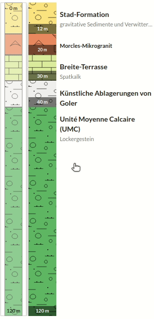

# React Stratigraphy


<br/>
<br/>

A simple reactjs module for creating graphical representations of stratigraphies (used in geology to describe the vertical location of rock units).


Example:



<br/>
<br/>

## Installation

Install the module with npm:

```
npm install @ist-supsi/stratigraphy
```

or use yarn:

```
yarn add @ist-supsi/stratigraphy
```

## Usage

```javascript

import React from 'react';
import { Stratigraphy } from '@ist-supsi/stratigraphy';

const ExampleComponent = props => {
  return (
    <Stratigraphy
      data={
        [
          {
            id: 1,
            from: 0,
            to: 1.23,
            color: '#123456',
            pattern: 'assets/pattern-1.png',
            title: 'Jura des Juragebirges',
            subtitle: 'Dazit'
          }, {
            id: 2,
            from: 1.23,
            to: 1.77,
            color: '#789123',
            pattern: 'assets/pattern-2.png',
            title: 'Quartar, undifferenziert',
            subtitle: 'Phonolith'
          }, {
            id: 3,
            from: 1.77,
            to: 2.34,
            color: '#456789',
            pattern: 'assets/pattern-3.png',
            title: 'Altere Ablagerungen, undifferenziert',
            subtitle: 'Magmatit'
          }
        ]
      }
      onSelected={(layer)=>{
        console.log(layer);
      }}
      style={{
        height: '300px',
        width: '250px'
      }}
      unit='m'
    />
  );
};

export default ExampleComponent;

```

## Dev corner


### Install the requirements

```bash
cd ./js-stratigraphy
docker run --rm -it \
    -v $PWD:/app \
    -w /app \
    -u $(id -u ${USER}):$(id -g ${USER}) \
    node:16.13.1-alpine3.14 \
        npm install
```

### Run dev Server

Access to http://localhost:3000

```bash
docker run --rm -it \
    -v $PWD:/app \
    -w /app \
    -u $(id -u ${USER}):$(id -g ${USER}) \
    --network="host" \
    -e PORT=3000 \
    node:16.13.1-alpine3.14 \
    npm start
```

### Build the library for release

```bash
docker run --rm -it \
    -v $PWD:/app \
    -w /app \
    -u $(id -u ${USER}):$(id -g ${USER}) \
    --network="host" \
    node:16.13.1-alpine3.14 \
        npm run build-lib
```


### Watch the library for changes if used as a linked module

```bash
docker run --rm -it \
    -v $PWD:/app \
    -w /app \
    -u $(id -u ${USER}):$(id -g ${USER}) \
    --network="host" \
    node:16.13.1-alpine3.14 \
        npm run build-watch
```